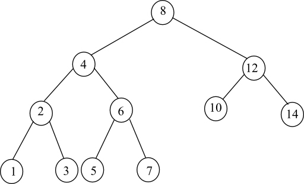

> # **```Heap```**
Heap is an array representation of a compelete binary tree.

> ## **```Array representation of a complete binary tree```**



The abovementioned complete binary tree, can be represented in an array like below:   
**[8, 4, 12, 2, 6, 10, 14, 1, 3, 5, 7]**  
But implementing those value into an array has drawback of losing track of left and right childs.  
To encounter this problem these two formulas can help <ins>find the left and right childs</ins>.
1. **Left child**: parent_index_in_array * 2 + 1
2. **Right child**: parent_index_in_array * 2 + 2

To <ins>find the parent</ins> of a child node use the formula:
1. **Parent**:  (current_child_index_in_array - 1)/ 2

> ## **```Types of Heap```**
1. **Max Heap**: Max heap is a complete binary tree that always returns the maximum value of a current subtree.
For each node (consider parent of a subtree) of a max heap, it's child can't be greater than it(lesser than or equal to the parent node).

2. **Min Heap**: Min heap has all the opposite features of max heap.

While creating a max heap or min heap always consider these following rules:
1. Is the heap maintaining