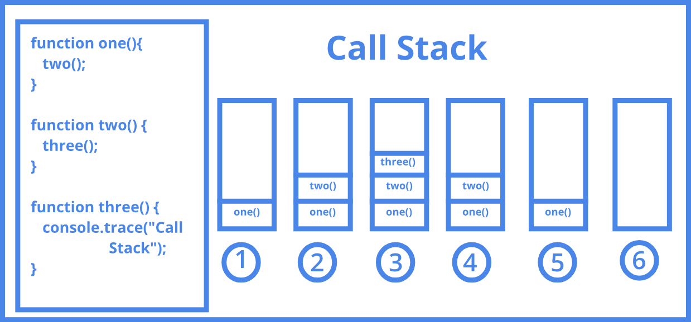

> #  ```Module 17```

<p align="center" style="font-size: 25px"><b>Call Stack</b></p>

The call stack is an internal data structure that stores information about active function calls and keeps track of their order. The first function that is invoked will be executed last in a Last-In-First-Out (LIFO) manner. Once a function is invoked, no other function below it in the call stack will execute until the invoked function returns.



<p align="center" style="font-size: 25px"><b>Memory Structure of C and C++</b></p>


<p align="center" style="font-size: 25px"><b>Recursion</b></p>

Recursion is a fuction that calls itself until it reaches a base case and accomplish certain task.

<ins>**Stack overflow and segmentation**</ins>: Recursion could cause unlimited recursive function calls. Since call stack has a limited size bounty, it will easily overpass the boundary and create overflow. The overflow is known as 'Stack Overflow' and this creates segmentation fault in application.

To avoid segmentation error, programmers need to be careful about designing safe base case to terminate endless recursive call.


