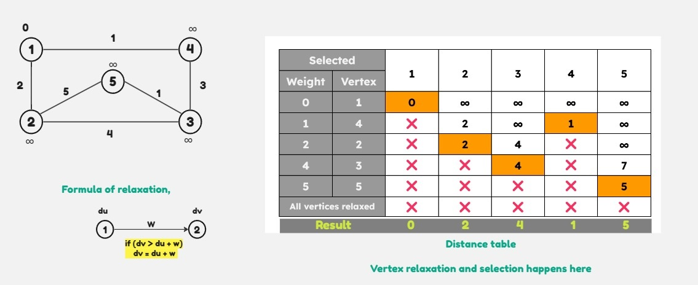

> # ```Shortest Path Algorithm```


### BFS level is shortest distance or path. But BFS isn't always applicable, if we're given a weighted graph (where edges have different weights).

Here the concern is to cover distance within minimum steps.

- Source: **Level 0** 
- Children of the source or level 0: **Level 1**
- Children of source or vertex level 1: **Level 2**
- Children of source or vertex level 'n': **Level n + 1**

### BFS could be used for finding **SSSP** (Single Source Shortest Path) when, 
1. Graph is directed or undirected.
2. Graph is unweighted or a weighted graph, but only if all edges have same weight.
3. Graph nodes or vertices are non-negative.
4. Graph has non negative edge weight.

### BFS can't be used when,  
1. Graph is weighted.
2. Graph has negative node and non-negative edge weight.

### Solutions
1. **Dijkstra's alogrithm**: Works for positive weighted graph. Doesn't work for negative edges. 
2. **Bellman-Ford algorithm**: Works for both negative nodes and negative edge weight.

## ```Dijkstra's Algorithm```

### Why Dijkstra?
> Suppose, you're a developer and your task is to create a bus travelling and tracking application, where user can select a source or place or station from where he/she can reach to any other station or destination. As the city has multiple routes or paths to travel from one station to another. Now, you have to create the application that can provide shortest distance from the source station (user selected) to any other station.

Single source shortest path finding algorithm for unweighted undirected graph.   
- Here the first concern is to find a minimum distance that covers minimum weight. 
- If we have two path with similar minimum weight, then we must pick the path the covers minimum steps only.
- Dijkstra is a greedy algorithm, so it picks the most optimal distance at the current time. At the current time, in which vertex we can go with minimum value.

Steps:
1. Try to relax the childs of a node vertex
2. If relaxed the, push to the priority queue (min heap).



### <ins>Time Complexity of Dijkstra's algorithm</ins>
O(N + M)

### Limitations of Dijkstra's algorithm

